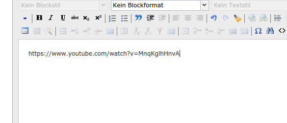
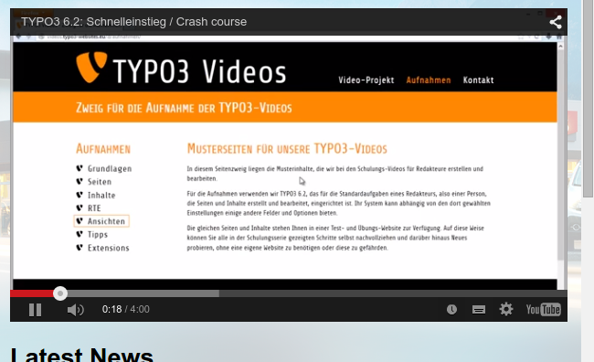

.. ==================================================
.. FOR YOUR INFORMATION
.. --------------------------------------------------
.. -*- coding: utf-8 -*- with BOM.

.. include:: ../Includes.txt

.. _introduction:

Introduction
============

.. _what-it-does:

What does it do?
----------------

This extension replaces video URLs from Youtube, Vimeo and Dalymotion with a video thumbnail, which
when clicked gets replaced by the appropriate iframe. It uses Bootstrap responsive embed classes
and jQuery for the actual replacement. This makes loading of pages containing videos real fast.

`Read more <http://www.sitepoint.com/faster-youtube-embeds-javascript/>`_ about this technique.

.. _screenshots:

Screenshots
-----------

See the extension in action:

You enter the Video URL as you see it in your Browser, just copy&paste from the adressbar, e.g. into a textfield.

   Video URL in the Backend

Video thumbnail in the frontend:

	
   the video url (http://...) is replaced by a video thumbnail from the video hosters API.

Iframe when thumbnail is clicked:
	

   the video thumbnail is replaced by an iframe.
   
   
*Note:*
	There is no way to set width and height of the videos, instead the responsive embed class from Bootstrap is used,
	-> **the videos will always use 100% of the parent container!**
	
	Additionally the Bootstrap CSS class *embed-responsive-16by9* is used which means **the aspect ratio will always be 16:9**.
